# System Architecture Overview

This document provides a comprehensive visual overview of the system architecture and component interactions.

## Architecture Diagram

```mermaid
graph TB
    subgraph "Client Layer"
        Web["🌐 Web Client"]
        Mobile["📱 Mobile Client"]
    end
    
    subgraph "API Gateway"
        LB["⚖️ Load Balancer"]
    end
    
    subgraph "Application Layer"
        API1["🖥️ API Server 1"]
        API2["🖥️ API Server 2"]
        API3["🖥️ API Server 3"]
    end
    
    subgraph "Cache & Session"
        Redis["💾 Redis Cache"]
    end
    
    subgraph "Data Layer"
        DB["🗄️ Primary Database"]
        DBReplica["🗄️ Database Replica"]
    end
    
    subgraph "External Services"
        S3["☁️ S3 Storage"]
        Queue["📨 Message Queue"]
    end
    
    Web --> LB
    Mobile --> LB
    LB --> API1
    LB --> API2
    LB --> API3
    
    API1 --> Redis
    API2 --> Redis
    API3 --> Redis
    
    API1 --> DB
    API2 --> DB
    API3 --> DB
    
    DB --> DBReplica
    
    API1 --> S3
    API2 --> S3
    API3 --> S3
    
    API1 --> Queue
    API2 --> Queue
    API3 --> Queue
```

## Component Description

### Client Layer
- **Web Client**: Browser-based user interface
- **Mobile Client**: Native or cross-platform mobile applications

### API Gateway
- **Load Balancer**: Distributes incoming traffic across API servers

### Application Layer
- **API Servers**: Multiple instances for high availability and scalability
- Handles business logic and request processing

### Cache & Session
- **Redis Cache**: In-memory data store for improved performance
- Stores sessions and frequently accessed data

### Data Layer
- **Primary Database**: Main database for persistent data storage
- **Database Replica**: Read replica for load distribution and disaster recovery

### External Services
- **S3 Storage**: Cloud object storage for files and assets
- **Message Queue**: Asynchronous task processing and event handling

## Key Features

✅ **High Availability**: Multiple API server instances with load balancing
✅ **Scalability**: Horizontal scaling capability
✅ **Performance**: Redis caching layer for faster response times
✅ **Reliability**: Database replication for data redundancy
✅ **Async Processing**: Message queue for background jobs
✅ **Storage**: Cloud-based object storage integration

## Deployment Considerations

- Use containerization (Docker) for consistent deployments
- Implement auto-scaling policies based on load
- Monitor all components with observability tools
- Use infrastructure-as-code for reproducible deployments